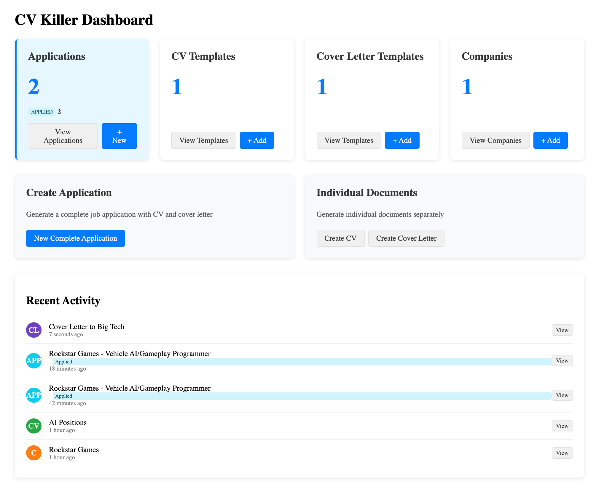

# CV Killer

> LaTeX as editing language for CV and Cover Letter
> Recommend copy and paste from your favorite LaTeX Editor.
> This is mainly for tracking and managing applications.
> CV Killer is a tool for managing one's job application process, because management of CV and Cover Letter could be a tedious task.




## Features

- **Document Management**

  - Create and store CV templates
  - Design personalized cover letter templates
  - Edit LaTeX documents directly in the browser
  - Track document revisions and changes
- **Company Management**

  - Store company information and job postings
  - Customize company-specific details for each application
  - Add custom fields for better personalization
- **Application Tracking**

  - Create complete applications with both CV and cover letter
  - Track application status (Applied, Interview, Offer, Rejected, Withdrawn)
  - See application history with detailed timestamps
  - Add notes and feedback for each application
- **PDF Generation**

  - Generate professional PDFs from LaTeX templates
  - Customize documents for each company
  - Regenerate updated documents as needed
  - Preview before finalizing

## Getting Started

### Prerequisites

- Node.js (v16+)
- LaTeX installation (for PDF generation)

### Installation

1. Clone this repository

   ```
   git clone https://github.com/yourusername/cv-killer.git
   cd cv-killer
   ```
2. Install dependencies

   ```
   npm install
   ```
3. Start the development servers

   ```
   npm run dev
   ```

This will start both the frontend (Svelte) and backend (Express) servers.

- Frontend: http://localhost:5173
- Backend: http://localhost:3001

### Project Structure

- `/src` - Frontend code (SvelteKit)
- `/server` - Backend Express server
- `/build` - Generated PDF documents
- `/common` - Shared LaTeX styles and templates

## Usage

1. **Create Templates**:

   - Add CV templates with your professional information
   - Create cover letter templates with placeholder sections
2. **Add Companies**:

   - Enter company information and job details
   - Add custom fields for specific requirements
3. **Generate Applications**:

   - Combine a template with company information
   - Customize content for each application
   - Generate professional PDFs
4. **Track Applications**:

   - Update application status as you progress
   - Add notes about interviews and feedback
   - Edit documents as needed

## LaTeX Templates

CV Killer uses LaTeX to generate professional-looking documents. Basic templates are provided, but you can customize them to match your style.

### Template Placeholders

Use curly braces to create placeholders in your LaTeX templates:

- `{companyName}` - Company name
- `{position}` - Job position
- `{customContent}` - Custom content for cover letters
- `{anyFieldName}` - Any custom field defined in company data

## Contributing

Contributions are welcome! Please feel free to submit a Pull Request.
